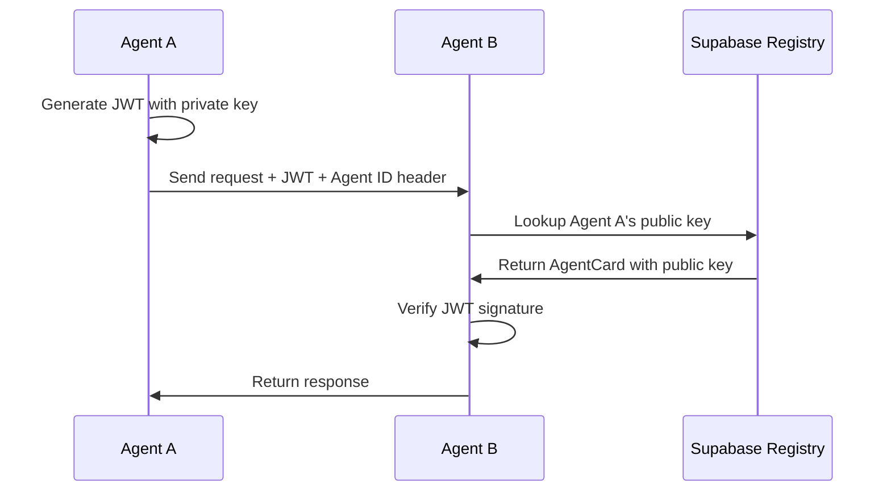

<div align="center">
  
  
  # Phlow: A2A Protocol Authentication
  
  *The authentication foundation for the Agent-to-Agent Protocol ecosystem*
</div>

[](https://www.npmjs.com/package/phlow-auth)
[](https://pypi.org/project/phlow-auth/)
[](https://opensource.org/licenses/MIT)

## 🎯 What is Phlow?

Phlow is the JWT authentication foundation for the [A2A Protocol](https://a2aproject.github.io/A2A/latest/specification/) ecosystem. It enables AI agents to securely authenticate with each other while maintaining full compatibility with A2A standards for discovery, capabilities, and communication.

**A2A Protocol Native • Secure • Developer-Friendly**

## ⚡ Quick Start

```bash
npm install phlow-auth
# or
pip install phlow-auth
```

```javascript
// Protect your endpoints in one line
app.post('/api/chat', phlow.authenticate(), (req, res) => {
  res.json({ 
    message: 'Hello from ' + req.phlow.agent.name,
    permissions: req.phlow.claims.permissions 
  });
});

// Call other agents securely
const response = await phlow.callAgent('https://other-agent.ai/analyze', {
  dataset: 'sales-2024.csv'
});
```

[Full Setup Guide →](docs/getting-started.md)

## 🚀 Features

- **🔐 Simple JWT Auth** - RS256 signed tokens, no complexity
- **🤖 A2A Protocol Native** - Full AgentCard and discovery compliance
- **🔍 Well-Known Endpoints** - Standard `/.well-known/agent.json` support
- **🗃️ Supabase Registry** - Store agent public keys and metadata
- **🌐 Multi-Language** - JavaScript/TypeScript and Python
- **🛠️ CLI Tools** - Quick setup and testing


## How It Works



## 📦 What's Included

```
phlow/
├── packages/
│   ├── phlow-auth-js/          # Core JavaScript library
│   ├── phlow-auth-python/      # Core Python library  
│   └── phlow-cli/              # CLI tools
├── examples/
│   └── a2a-compatible-agent/   # A2A Protocol example
└── docs/
    ├── getting-started.md      # Quick setup guide
    ├── a2a-compatibility.md    # A2A Protocol integration
    └── api-reference.md        # API documentation
```

## A2A Protocol Compatibility

Phlow implements key aspects of the [A2A Protocol](https://a2aproject.github.io/A2A/latest/specification/):

### ✅ A2A Protocol Compliance

- **AgentCard Format** - Complete A2A specification compatibility
- **Well-Known Discovery** - Standard `/.well-known/agent.json` endpoint  
- **JWT Security Schemes** - Seamless A2A authentication integration
- **Skills & Capabilities** - Native A2A agent skill declaration

### 🔄 A2A Protocol Roadmap

- **JSON-RPC 2.0 Messages** - Full A2A message format support
- **Task Management** - A2A stateful task operations  
- **Server-Sent Events** - A2A real-time streaming protocol

See [A2A Protocol Integration Guide](docs/a2a-compatibility.md) for complete specifications.


## 🔧 Setup

1. **Install**: `npm install phlow-auth` or `pip install phlow-auth`
2. **Configure**: Set up Supabase and environment variables
3. **Generate Keys**: `npx phlow-cli generate-keys`

[Detailed Setup Instructions →](docs/getting-started.md)

## 📚 Documentation

- **[Getting Started](docs/getting-started.md)** - Quick setup guide
- **[A2A Compatibility](docs/a2a-compatibility.md)** - A2A Protocol integration
- **[API Reference](docs/api-reference.md)** - Complete API docs

## 🌐 Language Support

| Language | Package | Framework Support |
|----------|---------|------------------|
| JavaScript/TypeScript | `phlow-auth` | Express.js, Node.js |
| Python | `phlow-auth` | FastAPI, Flask |

## Contributing

Pull requests welcome! Focus areas:

- A2A Protocol compatibility improvements
- Additional language libraries
- Documentation and examples

```bash
git clone https://github.com/prassanna-ravishankar/phlow.git
cd phlow
npm install
npm test
```

## License

MIT License - see [LICENSE](LICENSE) file for details.

---

**Built with ❤️ for the A2A ecosystem**

[Get Started](docs/getting-started.md) | [A2A Compatibility](docs/a2a-compatibility.md) | [API Reference](docs/api-reference.md)