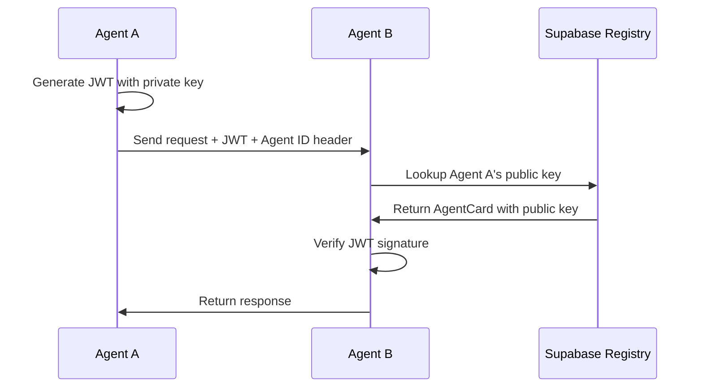

<div align="center">
  
  
  # Phlow: A2A Protocol + Supabase
  
  *A2A Protocol extension with Supabase superpowers for enhanced agent authentication*
</div>

[](https://www.npmjs.com/package/phlow-auth)
[](https://pypi.org/project/phlow-auth/)
[](https://opensource.org/licenses/MIT)

## 🎯 What is Phlow?

Phlow extends the official [A2A Protocol SDK](https://github.com/a2aproject/a2a-js) with Supabase integration, adding powerful features like audit logging, Row Level Security (RLS), and centralized agent registry. Built on top of the A2A SDK, Phlow lets you leverage the full A2A ecosystem while adding enterprise-grade features.

**A2A SDK Extension • Supabase Powered • Production Ready**

## ⚡ Quick Start

```bash
npm install phlow-auth
# or
pip install phlow-auth
```

```javascript
import { PhlowMiddleware } from 'phlow-auth';

// Initialize with A2A agent card + Supabase
const phlow = new PhlowMiddleware({
  agentCard: myA2AAgentCard,  // Standard A2A format
  privateKey: process.env.PRIVATE_KEY,
  supabaseUrl: process.env.SUPABASE_URL,
  supabaseAnonKey: process.env.SUPABASE_ANON_KEY,
  enableAuditLog: true  // Phlow enhancement
});

// Use A2A authentication with Supabase features
app.post('/api/chat', phlow.authenticate(), (req, res) => {
  // Access both A2A context and Supabase client
  const { agent, supabase } = req.phlow;
  res.json({ message: `Hello from ${agent.name}` });
});
```

[Full Setup Guide →](docs/getting-started.md)

## 🚀 Features

- **🤖 Built on A2A SDK** - Full A2A Protocol compliance via official SDK
- **🗃️ Supabase Integration** - Audit logs, RLS policies, agent registry
- **🔍 Enhanced Discovery** - A2A discovery + centralized Supabase registry
- **📊 Audit Trail** - Track all authentication events in Supabase
- **🌐 Multi-Language** - JavaScript/TypeScript and Python extensions
- **🛡️ RLS Helpers** - Generate Supabase Row Level Security policies


## How It Works



## 📦 What's Included

```
phlow/
├── packages/
│   ├── phlow-auth-js/          # Core JavaScript library
│   ├── phlow-auth-python/      # Core Python library  
│   └── phlow-cli/              # CLI tools
├── examples/
│   └── a2a-compatible-agent/   # A2A Protocol example
└── docs/
    ├── getting-started.md      # Quick setup guide
    ├── a2a-compatibility.md    # A2A Protocol integration
    └── api-reference.md        # API documentation
```

## 🔗 A2A Protocol Integration

Phlow extends the official [A2A SDK](https://github.com/a2aproject/a2a-js) rather than reimplementing it:

### ✅ What A2A SDK Provides

- **AgentCard Format** - Standard A2A agent metadata
- **JWT Authentication** - A2A-compliant token validation
- **Well-Known Discovery** - `/.well-known/agent.json` endpoint  
- **JSON-RPC 2.0** - Message protocol implementation
- **Task Management** - Stateful operations support

### 🚀 What Phlow Adds

- **Supabase Integration** - Centralized agent registry
- **Audit Logging** - Track all auth events in Supabase
- **RLS Policy Generation** - Secure your Supabase tables
- **Rate Limiting** - Built-in request throttling
- **Multi-Framework** - Express, FastAPI, Flask support  
- **Server-Sent Events** - A2A real-time streaming protocol

See [A2A Protocol Integration Guide](docs/a2a-compatibility.md) for complete specifications.


## 🔧 Setup

1. **Install**: `npm install phlow-auth` or `pip install phlow-auth`
2. **Configure**: Set up Supabase and environment variables
3. **Generate Keys**: `npx phlow-cli generate-keys`

[Detailed Setup Instructions →](docs/getting-started.md)

## 📚 Documentation

- **[Getting Started](docs/getting-started.md)** - Quick setup guide
- **[A2A Compatibility](docs/a2a-compatibility.md)** - A2A Protocol integration
- **[API Reference](docs/api-reference.md)** - Complete API docs

## 🌐 Language Support

| Language | Package | Framework Support |
|----------|---------|------------------|
| JavaScript/TypeScript | `phlow-auth` | Express.js, Node.js |
| Python | `phlow-auth` | FastAPI, Flask |

## Contributing

Pull requests welcome! Focus areas:

- A2A Protocol compatibility improvements
- Additional language libraries
- Documentation and examples

```bash
git clone https://github.com/prassanna-ravishankar/phlow.git
cd phlow
npm install
npm test
```

## License

MIT License - see [LICENSE](LICENSE) file for details.

---

**Built with ❤️ for the A2A ecosystem**

[Get Started](docs/getting-started.md) | [A2A Compatibility](docs/a2a-compatibility.md) | [API Reference](docs/api-reference.md)