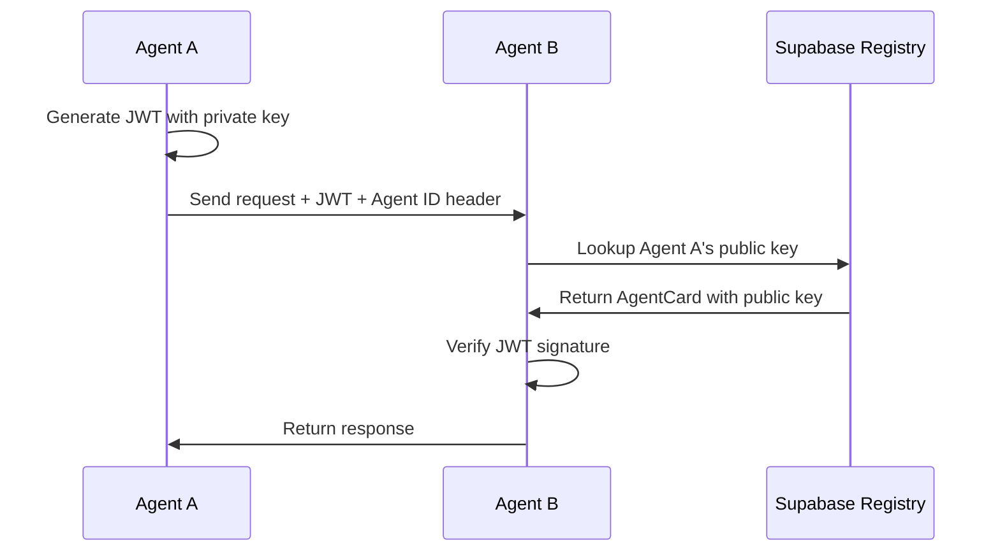

<div align="center">
  
  
  # Phlow
  
  **Authentication middleware for AI agents with persistent storage and security**
</div>

<div align="center">

[](https://www.npmjs.com/package/phlow-auth)
[](https://pypi.org/project/phlow-auth/)
[](https://opensource.org/licenses/MIT)

</div>

## 🎯 What is Phlow?

Phlow provides secure authentication middleware for AI agents, with persistent storage and enterprise security features. Built on the A2A Protocol with Supabase integration, it enables agents to authenticate and communicate securely while maintaining audit trails and access controls.

**Secure Agent Auth • Persistent Storage • Production Ready**

## ⚡ Quick Start

```bash
npm install phlow-auth
# or
pip install phlow-auth
```

### JavaScript Example

```javascript
import { PhlowMiddleware } from 'phlow-auth';

const phlow = new PhlowMiddleware({
  agentCard: {
    schemaVersion: '1.0',
    name: 'My Agent',
    description: 'Agent description', 
    serviceUrl: 'https://my-agent.com',
    skills: ['chat', 'analysis'],
    securitySchemes: {},
    metadata: {
      agentId: 'my-agent-id',
      publicKey: 'public-key-here'
    }
  },
  privateKey: process.env.PRIVATE_KEY,
  supabaseUrl: process.env.SUPABASE_URL,
  supabaseAnonKey: process.env.SUPABASE_ANON_KEY
});
```

### Python Example

```python
from phlow_auth import PhlowMiddleware, AgentCard, PhlowConfig

config = PhlowConfig(
    agent_card=AgentCard(
        name="My Agent",
        description="Agent description",
        service_url="https://my-agent.com", 
        skills=["chat", "analysis"],
        metadata={"agent_id": "my-agent-id", "public_key": "public-key-here"}
    ),
    private_key=os.environ["PRIVATE_KEY"],
    supabase_url=os.environ["SUPABASE_URL"],
    supabase_anon_key=os.environ["SUPABASE_ANON_KEY"]
)

phlow = PhlowMiddleware(config)
```

### Express.js Middleware

```javascript
// Use A2A authentication with Supabase features
app.post('/api/chat', phlow.authenticate(), (req, res) => {
  // Access both A2A context and Supabase client
  const { agent, supabase } = req.phlow;
  res.json({ message: `Hello from ${agent.name}` });
});
```

[Full Setup Guide →](docs/getting-started.md)

## 🚀 Features

- **🔐 JWT Authentication** - Secure agent-to-agent authentication with industry standards
- **📋 Agent Registry** - Persistent storage and discovery of agent capabilities
- **🛡️ Row Level Security** - Fine-grained data access controls in Supabase
- **📊 Audit Logging** - Complete trail of authentication and access events
- **🌐 Multi-Language** - JavaScript/TypeScript and Python support
- **⚡ Production Ready** - Rate limiting, error handling, and monitoring


## How It Works



## 📦 What's Included

```
phlow/
├── packages/
│   ├── phlow-auth-js/          # JWT auth middleware for JavaScript
│   └── phlow-auth-python/      # JWT auth middleware for Python
└── docs/
    ├── getting-started.md      # Quick setup guide
    ├── a2a-compatibility.md    # A2A Protocol integration
    └── api-reference.md        # API documentation
```

## 🏗️ Architecture

Phlow provides a secure authentication layer that integrates with your existing infrastructure:

- **Standards-Based** - Built on JWT tokens and A2A Protocol specifications
- **Database Integration** - Supabase backend for persistent agent data
- **Middleware Pattern** - Drop-in authentication for web frameworks
- **Extensible** - Plugin architecture for custom authentication flows

See [Architecture Guide](docs/concepts/how-it-works.md) for technical details.


## 🔧 Setup

1. **Install**: `npm install phlow-auth` or `pip install phlow-auth`
2. **Configure**: Set up Supabase project and environment variables
3. **Initialize**: Register your agent card in Supabase
4. **Authenticate**: Add Phlow middleware to your A2A agent

[Detailed Setup Instructions →](docs/getting-started.md)

## 💡 Example: A2A Agent with Phlow Auth

```javascript
// A2A + Phlow Integration
import { PhlowMiddleware } from 'phlow-auth';

const agentCard = {
  schemaVersion: '1.0',
  name: 'My Agent',
  description: 'A2A-compatible agent',
  serviceUrl: 'https://my-agent.com',
  skills: ['chat', 'analysis'],
  securitySchemes: {},
  metadata: {
    agentId: 'my-agent-id',
    publicKey: process.env.PUBLIC_KEY
  }
};

// Initialize Phlow for authentication
const phlow = new PhlowMiddleware({
  agentCard,
  supabaseUrl: process.env.SUPABASE_URL,
  supabaseAnonKey: process.env.SUPABASE_ANON_KEY,
  privateKey: process.env.PRIVATE_KEY
});

// Add Phlow auth middleware to Express
app.use('/api/a2a', phlow.authenticate());

// Handle A2A messages
app.post('/api/a2a/message', async (req, res) => {
  const { phlow } = req; // Contains agent, supabase, a2aClient
  // Process A2A message using phlow context
  res.json({ status: 'received' });
});
```

## 📚 Documentation

- **[Getting Started](docs/getting-started.md)** - Quick setup guide
- **[A2A Compatibility](docs/a2a-compatibility.md)** - A2A Protocol integration
- **[API Reference](docs/api-reference.md)** - Complete API docs

## 🌐 Language Support

| Language | Package | Framework Support |
|----------|---------|------------------|
| JavaScript/TypeScript | `phlow-auth` | Express.js, Node.js |
| Python | `phlow-auth` | FastAPI, Flask |

## Contributing

Pull requests welcome! Focus areas:

- Authentication middleware improvements
- Supabase integration enhancements
- Additional language/framework support
- Documentation and examples

**Scope**: Please keep contributions focused on authentication, agent registry, and RLS. Communication features should be contributed to the [A2A Protocol](https://github.com/a2aproject) directly.

```bash
git clone https://github.com/prassanna-ravishankar/phlow.git
cd phlow
npm install
npm test
```

## License

MIT License - see [LICENSE](LICENSE) file for details.

---

**Built with ❤️ for the A2A ecosystem**

[Get Started](docs/getting-started.md) | [A2A Compatibility](docs/a2a-compatibility.md) | [API Reference](docs/api-reference.md)