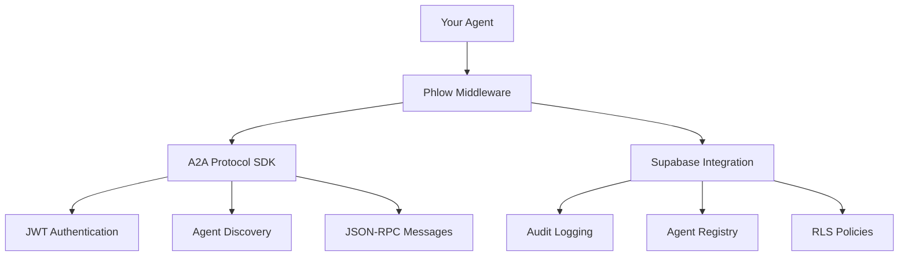

# How Phlow Works

Understand Phlow's architecture and authentication flow.

## Overview

Phlow is a lightweight middleware that adds Supabase database integration to A2A Protocol JWT authentication. It provides token verification, agent card storage, and basic middleware helpers for web applications.



## The Stack

### A2A Protocol Layer
- **JWT Authentication** - Standard A2A token format
- **Agent Discovery** - `/.well-known/agent.json` endpoints
- **Message Protocol** - JSON-RPC 2.0 communication
- **Task Management** - Stateful operations

### Phlow Enhancement Layer  
- **Audit Trail** - Track all authentication events
- **Rate Limiting** - Prevent abuse and overload
- **Agent Registry** - Centralized discovery via Supabase
- **RLS Helpers** - Generate Row Level Security policies

### Supabase Integration
- **Database Storage** - Agent cards, audit logs, metrics
- **Row Level Security** - Agent-specific data access
- **Real-time Updates** - Live agent status changes
- **Analytics** - Usage patterns and performance metrics

## Authentication Flow

1. **Agent Registration**
   ```javascript
   // Agent registers in Supabase registry
   await phlow.registerAgent(agentCard);
   ```

2. **Token Creation**
   ```javascript
   // A2A SDK creates JWT with your private key
   const token = phlow.createToken({ targetAgent: 'agent-b' });
   ```

3. **Request Processing**
   ```javascript
   // Phlow validates via A2A SDK + logs to Supabase
   app.post('/api', phlow.authenticate(), handler);
   ```

4. **Response & Audit**
   ```javascript
   // Success/failure logged automatically
   // Rate limiting applied
   // RLS policies enforced
   ```

## Key Benefits

### 🔒 **Security**
- Standard A2A Protocol compliance
- Automatic audit trail
- Rate limiting protection
- Row Level Security policies

### 🚀 **Performance**
- Connection pooling
- Agent card caching
- Optimized database queries
- Async/await throughout

### 🛠 **Developer Experience**
- One-line authentication
- Auto-generated RLS policies
- Rich error messages
- Multi-language support

### 📊 **Observability**
- Real-time metrics
- Failed request tracking
- Performance monitoring
- Usage analytics

## Use Cases

**Phlow is useful for:**

🔧 **Web Applications** - Adding A2A auth to Express/FastAPI apps

📋 **Agent Storage** - Persisting agent cards in a database

🔐 **Token Verification** - Validating A2A Protocol JWTs

📊 **Basic Logging** - Tracking authentication events

🚪 **Prototyping** - Quick A2A + Supabase integration

## Next Steps

- [A2A Protocol Integration](a2a-integration.md) - How Phlow uses A2A
- [Supabase Features](supabase-features.md) - What Supabase adds
- [Architecture](../advanced/architecture.md) - Technical deep dive