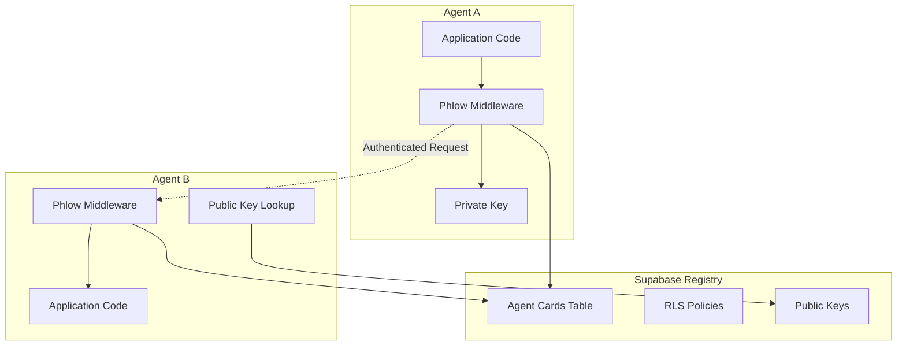
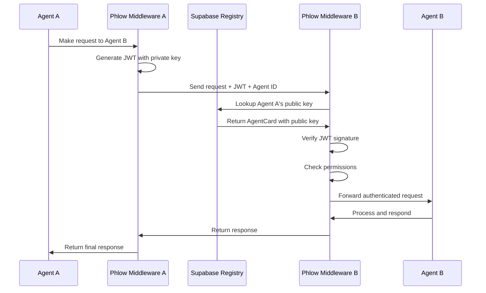
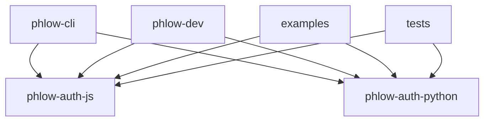

# Project Architecture

Phlow is designed as a secure, scalable Agent-to-Agent authentication framework with a focus on developer experience and production readiness.

## Core Design Principles

### 🔒 Security First

- **RS256 JWT tokens** with asymmetric cryptography
- **Public key infrastructure** for agent verification
- **Zero-trust architecture** with explicit authentication
- **Supabase RLS policies** for data protection

### 🤖 A2A Protocol Native

- **Full A2A specification compliance** for interoperability
- **AgentCard discovery** via `/.well-known/agent.json`
- **Standardized JWT claims** for permissions and metadata
- **Future-proof design** for protocol evolution

### 👨‍💻 Developer Experience

- **Minimal integration** (2-3 lines of code)
- **Multi-language support** (JavaScript/TypeScript, Python)
- **Rich tooling** (CLI, development server, examples)
- **Comprehensive documentation** and examples

### 🚀 Production Ready

- **Rate limiting** and audit logging built-in
- **Structured error handling** with proper HTTP codes
- **Horizontal scaling** support
- **Monitoring and observability** hooks

## System Architecture

### High-Level Components



### Authentication Flow



## Package Architecture

### Monorepo Structure

```
phlow/
├── packages/
│   ├── phlow-auth-js/      # Core JavaScript/TypeScript library
│   ├── phlow-auth-python/  # Core Python library
│   ├── phlow-cli/          # Development and testing tools
│   └── phlow-dev/          # Local development utilities
├── examples/               # Working examples and demos
├── tests/                  # Integration and e2e tests
└── docs/                   # Documentation
```

### Package Dependencies



### Core Package Design

#### phlow-auth-js
```typescript
// Clean middleware pattern
class PhlowMiddleware {
  constructor(config: PhlowConfig)
  authenticate(): MiddlewareFunction      // Express.js compatible
  wellKnownHandler(): MiddlewareFunction  // A2A discovery
  callAgent(url: string, data: any): Promise<any>  // Outbound calls
}
```

#### phlow-auth-python
```python
# Async-first with framework integrations
class PhlowMiddleware:
    def __init__(self, config: PhlowConfig)
    async def authenticate(self, token: str, agent_id: str) -> PhlowContext
    def well_known_handler(self) -> Dict[str, Any]
    async def call_agent(self, url: str, data: Dict[str, Any]) -> Any

# Framework-specific integrations
class FastAPIIntegration:
    def create_auth_dependency(self) -> Callable
    def require_auth(self) -> Callable
```

## Security Architecture

### JWT Token Structure

```json
{
  "header": {
    "alg": "RS256",
    "typ": "JWT"
  },
  "payload": {
    "sub": "requesting-agent-id",
    "iss": "requesting-agent-id", 
    "aud": "target-agent-id",
    "exp": 1234567890,
    "iat": 1234567890,
    "permissions": ["read:data", "write:analysis"],
    "skills": ["data-analysis", "visualization"],
    "metadata": {
      "request_id": "req-123",
      "version": "1.0"
    }
  }
}
```

### Key Management

**Agent Registration Flow**:
1. Agent generates RSA key pair (2048-bit minimum)
2. Public key stored in Supabase agent_cards table
3. Private key kept secure by agent (environment variable, key vault)
4. Agent ID becomes unique identifier across network

**Key Rotation Support**:
- Multiple public keys per agent (planned)
- Key versioning in JWT header
- Graceful key transition periods

### Permission System

**Permission Format**: `action:resource` (e.g., `read:data`, `admin:users`)

**Authorization Levels**:
1. **Agent-level**: Basic agent authentication
2. **Permission-based**: Specific capability checks
3. **Resource-specific**: Fine-grained access control

**Supabase RLS Integration**:
```sql
-- Example: Permission-based table access
CREATE POLICY "data_read_access" ON data_table
FOR SELECT USING (
  auth.jwt() -> 'permissions' ? 'read:data'
);
```

## Data Architecture

### Supabase Schema

**Agent Cards Table**:
- **Primary storage** for agent metadata and public keys
- **JSONB fields** for flexible skill and metadata storage
- **RLS policies** for secure multi-tenant access
- **Indexed queries** for efficient agent discovery

**Audit Logs** (planned):
- Authentication events
- Permission checks
- Rate limit violations
- Cross-agent communication logs

### Caching Strategy

**Agent Card Caching**:
- **Local cache** for frequently accessed agents
- **TTL-based expiration** to handle key rotation
- **Cache invalidation** on agent updates

**Token Validation Caching**:
- **JWT verification results** cached short-term
- **Public key caching** to reduce database calls
- **Distributed cache** support for scaled deployments

## Scaling Considerations

### Horizontal Scaling

**Stateless Design**:
- No server-side session storage
- JWT tokens carry all necessary context
- Database-driven configuration

**Load Balancing**:
- Any instance can handle any request
- Shared Supabase backend
- Optional Redis for distributed caching

### Performance Optimizations

**Database Queries**:
- Indexed agent_id lookups
- Batched agent card retrievals
- Connection pooling

**JWT Operations**:
- Cached public key objects
- Optimized cryptographic operations
- Parallel verification for batch requests

### Monitoring & Observability

**Key Metrics**:
- Authentication success/failure rates
- Token verification latency
- Agent card lookup performance
- Rate limiting trigger frequency

**Logging Strategy**:
- Structured JSON logs
- Request correlation IDs
- Security event logging
- Performance metrics

## Extension Points

### Framework Integrations

**Current**: Express.js (JS), FastAPI (Python)
**Planned**: Flask, Django, Koa, NestJS

**Integration Pattern**:
```typescript
// Generic middleware function signature
type MiddlewareFunction<T> = (req: T, res: any, next: any) => void | Promise<void>
```

### Protocol Extensions

**A2A Evolution Support**:
- JSON-RPC 2.0 message format
- Server-sent events for real-time communication
- Task delegation and state management
- Multiple authentication schemes

### Custom Validation

**Extensible Validation Pipeline**:
```typescript
interface ValidationHook {
  validate(context: PhlowContext): Promise<ValidationResult>
}
```

**Plugin System** (planned):
- Custom permission resolvers
- Enhanced audit logging
- Rate limiting algorithms
- Caching strategies

---

This architecture provides a solid foundation for secure, scalable agent-to-agent authentication while maintaining simplicity for developers and compatibility with the A2A protocol ecosystem.