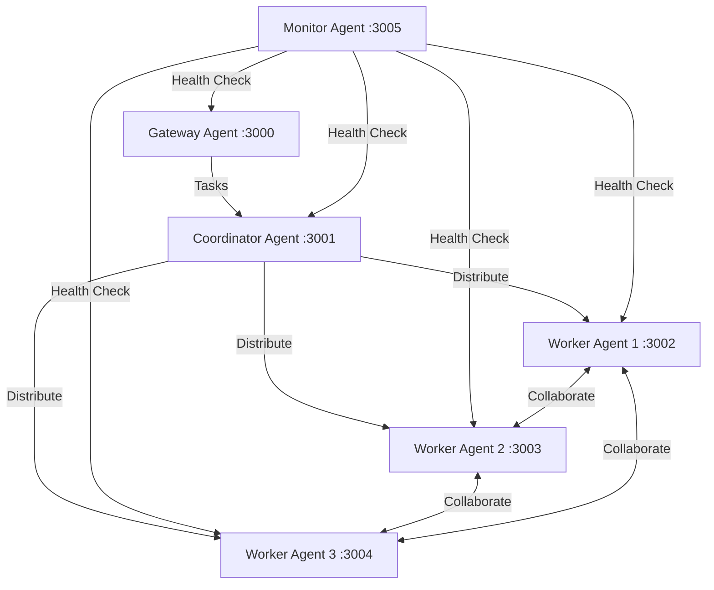

# Multi-Agent Network Example

This example demonstrates how to set up a network of Phlow agents that can communicate with each other securely.

## Overview

The multi-agent network example includes:

- **Coordinator Agent**: Manages network topology and routing
- **Worker Agents**: Process tasks and communicate results
- **Gateway Agent**: Handles external API requests
- **Monitor Agent**: Tracks network health and performance

## Architecture



## Setup

### 1. Install Dependencies

```bash
git clone https://github.com/prassanna-ravishankar/phlow.git
cd phlow/examples/multi-agent-network-example
npm install
```

### 2. Generate Keys for All Agents

```bash
# Generate keys for each agent
npx phlow-cli generate-keys --output ./keys/gateway
npx phlow-cli generate-keys --output ./keys/coordinator
npx phlow-cli generate-keys --output ./keys/worker1
npx phlow-cli generate-keys --output ./keys/worker2
npx phlow-cli generate-keys --output ./keys/worker3
npx phlow-cli generate-keys --output ./keys/monitor
```

### 3. Configure Environment

```bash
cp .env.example .env
```

Update the environment variables:

```env
# Supabase Configuration
SUPABASE_URL=your-supabase-url
SUPABASE_ANON_KEY=your-supabase-anon-key

# Network Configuration
GATEWAY_PORT=3000
COORDINATOR_PORT=3001
WORKER1_PORT=3002
WORKER2_PORT=3003
WORKER3_PORT=3004
MONITOR_PORT=3005
```

## Agent Implementations

### Gateway Agent (`src/gateway.js`)

Handles external requests and routes them to the coordinator:

```javascript
const { PhlowAuth } = require('phlow-auth-js');
const express = require('express');

const app = express();
app.use(express.json());

const phlow = new PhlowAuth({
  agentId: 'gateway-agent',
  privateKeyPath: './keys/gateway/private.pem',
  publicKeyPath: './keys/gateway/public.pem',
  supabaseUrl: process.env.SUPABASE_URL,
  supabaseKey: process.env.SUPABASE_ANON_KEY
});

// External API endpoint
app.post('/api/process', async (req, res) => {
  try {
    const { task, data } = req.body;
    
    // Forward to coordinator
    const response = await phlow.makeRequest({
      targetAgent: 'coordinator-agent',
      endpoint: '/tasks',
      method: 'POST',
      data: { task, data, requestId: generateId() }
    });
    
    res.json(response.data);
  } catch (error) {
    res.status(500).json({ error: error.message });
  }
});

app.listen(process.env.GATEWAY_PORT, () => {
  console.log(`Gateway agent running on port ${process.env.GATEWAY_PORT}`);
});
```

### Coordinator Agent (`src/coordinator.js`)

Manages task distribution and collects results:

```javascript
const { PhlowAuth } = require('phlow-auth-js');
const express = require('express');

const app = express();
app.use(express.json());

const phlow = new PhlowAuth({
  agentId: 'coordinator-agent',
  privateKeyPath: './keys/coordinator/private.pem',
  publicKeyPath: './keys/coordinator/public.pem',
  supabaseUrl: process.env.SUPABASE_URL,
  supabaseKey: process.env.SUPABASE_ANON_KEY
});

const workers = ['worker-agent-1', 'worker-agent-2', 'worker-agent-3'];
let currentWorker = 0;

// Task distribution endpoint
app.post('/tasks', phlow.middleware, async (req, res) => {
  try {
    const { task, data, requestId } = req.body;
    
    // Round-robin worker selection
    const selectedWorker = workers[currentWorker];
    currentWorker = (currentWorker + 1) % workers.length;
    
    // Send task to worker
    const response = await phlow.makeRequest({
      targetAgent: selectedWorker,
      endpoint: '/process',
      method: 'POST',
      data: { task, data, requestId }
    });
    
    res.json({
      status: 'processed',
      worker: selectedWorker,
      result: response.data
    });
  } catch (error) {
    res.status(500).json({ error: error.message });
  }
});

app.listen(process.env.COORDINATOR_PORT, () => {
  console.log(`Coordinator agent running on port ${process.env.COORDINATOR_PORT}`);
});
```

### Worker Agent (`src/worker.js`)

Processes tasks and can collaborate with other workers:

```javascript
const { PhlowAuth } = require('phlow-auth-js');
const express = require('express');

const createWorker = (agentId, port, keyPath) => {
  const app = express();
  app.use(express.json());

  const phlow = new PhlowAuth({
    agentId,
    privateKeyPath: `${keyPath}/private.pem`,
    publicKeyPath: `${keyPath}/public.pem`,
    supabaseUrl: process.env.SUPABASE_URL,
    supabaseKey: process.env.SUPABASE_ANON_KEY
  });

  // Task processing endpoint
  app.post('/process', phlow.middleware, async (req, res) => {
    const { task, data, requestId } = req.body;
    
    console.log(`${agentId} processing task: ${task}`);
    
    try {
      let result;
      
      switch (task) {
        case 'compute':
          result = await processComputation(data);
          break;
        case 'analyze':
          result = await processAnalysis(data);
          break;
        case 'collaborate':
          result = await collaborateWithPeers(data, phlow);
          break;
        default:
          throw new Error(`Unknown task: ${task}`);
      }
      
      res.json({
        worker: agentId,
        requestId,
        result,
        timestamp: new Date().toISOString()
      });
    } catch (error) {
      res.status(500).json({ error: error.message });
    }
  });

  // Collaboration with other workers
  async function collaborateWithPeers(data, phlow) {
    const peers = ['worker-agent-1', 'worker-agent-2', 'worker-agent-3']
      .filter(peer => peer !== agentId);
    
    const collaborationResults = await Promise.all(
      peers.map(async (peer) => {
        try {
          const response = await phlow.makeRequest({
            targetAgent: peer,
            endpoint: '/collaborate',
            method: 'POST',
            data: { request: 'peer-input', data }
          });
          return response.data;
        } catch (error) {
          return { error: error.message };
        }
      })
    );
    
    return {
      myContribution: processData(data),
      peerContributions: collaborationResults
    };
  }

  app.listen(port, () => {
    console.log(`${agentId} running on port ${port}`);
  });
};

// Create worker instances
createWorker('worker-agent-1', process.env.WORKER1_PORT, './keys/worker1');
createWorker('worker-agent-2', process.env.WORKER2_PORT, './keys/worker2');
createWorker('worker-agent-3', process.env.WORKER3_PORT, './keys/worker3');
```

### Monitor Agent (`src/monitor.js`)

Tracks network health and performance:

```javascript
const { PhlowAuth } = require('phlow-auth-js');
const express = require('express');

const app = express();
app.use(express.json());

const phlow = new PhlowAuth({
  agentId: 'monitor-agent',
  privateKeyPath: './keys/monitor/private.pem',
  publicKeyPath: './keys/monitor/public.pem',
  supabaseUrl: process.env.SUPABASE_URL,
  supabaseKey: process.env.SUPABASE_ANON_KEY
});

const agents = [
  'gateway-agent',
  'coordinator-agent', 
  'worker-agent-1',
  'worker-agent-2',
  'worker-agent-3'
];

// Network health monitoring
app.get('/network-status', async (req, res) => {
  const healthChecks = await Promise.all(
    agents.map(async (agent) => {
      try {
        const response = await phlow.makeRequest({
          targetAgent: agent,
          endpoint: '/health',
          method: 'GET',
          timeout: 5000
        });
        
        return {
          agent,
          status: 'healthy',
          responseTime: response.responseTime,
          lastCheck: new Date().toISOString()
        };
      } catch (error) {
        return {
          agent,
          status: 'unhealthy',
          error: error.message,
          lastCheck: new Date().toISOString()
        };
      }
    })
  );
  
  res.json({
    networkStatus: healthChecks,
    summary: {
      healthy: healthChecks.filter(h => h.status === 'healthy').length,
      total: healthChecks.length
    }
  });
});

app.listen(process.env.MONITOR_PORT, () => {
  console.log(`Monitor agent running on port ${process.env.MONITOR_PORT}`);
});
```

## Running the Network

### 1. Start All Agents

```bash
# Start in separate terminals or use PM2
npm run start:gateway
npm run start:coordinator  
npm run start:workers
npm run start:monitor
```

Or use the convenience script:

```bash
npm run start:all
```

### 2. Register Agents

```bash
npx phlow-cli register-agent --id gateway-agent --url http://localhost:3000
npx phlow-cli register-agent --id coordinator-agent --url http://localhost:3001
npx phlow-cli register-agent --id worker-agent-1 --url http://localhost:3002
npx phlow-cli register-agent --id worker-agent-2 --url http://localhost:3003
npx phlow-cli register-agent --id worker-agent-3 --url http://localhost:3004
npx phlow-cli register-agent --id monitor-agent --url http://localhost:3005
```

### 3. Test the Network

```bash
# Test task processing
curl -X POST http://localhost:3000/api/process \
  -H "Content-Type: application/json" \
  -d '{"task": "compute", "data": {"numbers": [1, 2, 3, 4, 5]}}'

# Check network health
curl http://localhost:3005/network-status

# Test collaboration
curl -X POST http://localhost:3000/api/process \
  -H "Content-Type: application/json" \
  -d '{"task": "collaborate", "data": {"problem": "distributed-computation"}}'
```

## Features Demonstrated

### Load Balancing
The coordinator distributes tasks across workers using round-robin scheduling.

### Fault Tolerance
Workers can handle failures gracefully and the monitor tracks agent health.

### Collaboration
Workers can communicate with each other to solve complex problems.

### Security
All inter-agent communication is authenticated and encrypted.

### Monitoring
Real-time network health monitoring and performance tracking.

## Advanced Configuration

### Custom Routing

Implement custom routing logic in the coordinator:

```javascript
const routingStrategy = {
  'compute': 'round-robin',
  'analyze': 'least-loaded', 
  'collaborate': 'all-workers'
};
```

### Load Balancing

Add worker load monitoring:

```javascript
const workerMetrics = {
  'worker-agent-1': { load: 0.3, tasks: 5 },
  'worker-agent-2': { load: 0.7, tasks: 12 },
  'worker-agent-3': { load: 0.1, tasks: 2 }
};
```

## Scaling the Network

### Adding New Workers

1. Generate keys for the new worker
2. Update the coordinator's worker list
3. Register the new agent
4. Start the worker process

### Horizontal Scaling

Deploy agents across multiple servers:

```yaml
# docker-compose.yml
version: '3.8'
services:
  gateway:
    build: .
    environment:
      - AGENT_TYPE=gateway
    ports:
      - "3000:3000"
  
  coordinator:
    build: .
    environment:
      - AGENT_TYPE=coordinator
    ports:
      - "3001:3001"
```

## Next Steps

- [API Reference](../api-reference.md) - Complete API documentation
- [Getting Started Guide](../getting-started.md) - Basic setup
- [Basic Agent Example](basic-agent.md) - Simple agent implementation