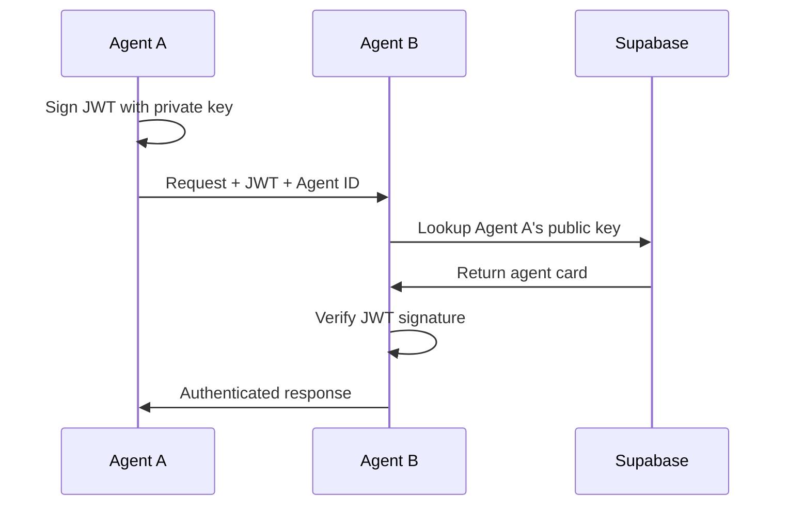

# Authentication Guide

How Phlow handles A2A Protocol authentication.

## How It Works



## Making Authenticated Requests

### As a Client
```javascript
// 1. Create a signed JWT
const token = await phlow.createToken({
  targetAgent: 'agent-b-id',
  permissions: ['read', 'write']
});

// 2. Make the request
const response = await fetch('https://agent-b.com/api/data', {
  headers: {
    'Authorization': `Bearer ${token}`,
    'X-Phlow-Agent-Id': 'agent-a-id'
  }
});
```

### As a Server
```javascript
// Phlow handles all verification automatically
app.post('/api/data', phlow.authenticate(), (req, res) => {
  // req.phlow contains verified agent info
  console.log('Request from:', req.phlow.agent.name);
  console.log('Permissions:', req.phlow.claims.permissions);
  
  res.json({ data: 'secure data' });
});
```

## JWT Token Structure

Phlow uses A2A-compliant JWT tokens:

```json
{
  "sub": "target-agent-id",    // Who can use this token
  "iss": "source-agent-id",    // Who created this token
  "aud": "target-agent-id",    // Intended recipient
  "exp": 1234567890,           // Expiration time
  "iat": 1234567890,           // Issued at time
  "permissions": ["read"],     // Granted permissions
  "metadata": {}               // Additional data
}
```

## Permission Checking

### Basic Check
```javascript
app.post('/api/write', 
  phlow.authenticate({ requiredPermissions: ['write'] }), 
  handler
);
```

### Manual Check
```javascript
app.post('/api/data', phlow.authenticate(), (req, res) => {
  const hasPermission = req.phlow.claims.permissions.includes('write');
  
  if (!hasPermission) {
    return res.status(403).json({ error: 'Insufficient permissions' });
  }
  
  // Process request
});
```

## Token Lifecycle

### Token Generation
```javascript
// Tokens are auto-generated when calling other agents
const response = await phlow.callAgent(url, data);
// Phlow creates and attaches the token automatically
```

### Token Expiry
- Default: 1 hour
- Configurable via `tokenExpiry` option
- Automatic refresh before expiry

### Token Refresh
```javascript
// Check if token needs refresh
if (await phlow.checkTokenRefresh(token)) {
  // Get new token
  const newToken = await phlow.refreshToken(token);
}
```

## Error Handling

Common authentication errors:

```javascript
try {
  await phlow.authenticate()(req, res, next);
} catch (error) {
  if (error.code === 'AGENT_NOT_FOUND') {
    // Agent not registered in Supabase
  } else if (error.code === 'TOKEN_EXPIRED') {
    // JWT has expired
  } else if (error.code === 'INVALID_SIGNATURE') {
    // JWT signature doesn't match
  }
}
```

## Audit Trail

With audit logging enabled, Phlow tracks:

- Successful authentications
- Failed authentication attempts
- Permission denials
- Rate limit violations

View in Supabase:
```sql
SELECT * FROM auth_audit_log 
WHERE agent_id = 'agent-a-id'
ORDER BY timestamp DESC;
```

## Next Steps

- [Making Agent Calls](agent-calls.md) - Call other agents
- [Security Best Practices](security.md) - Secure your implementation
- [Troubleshooting](troubleshooting.md) - Common auth issues