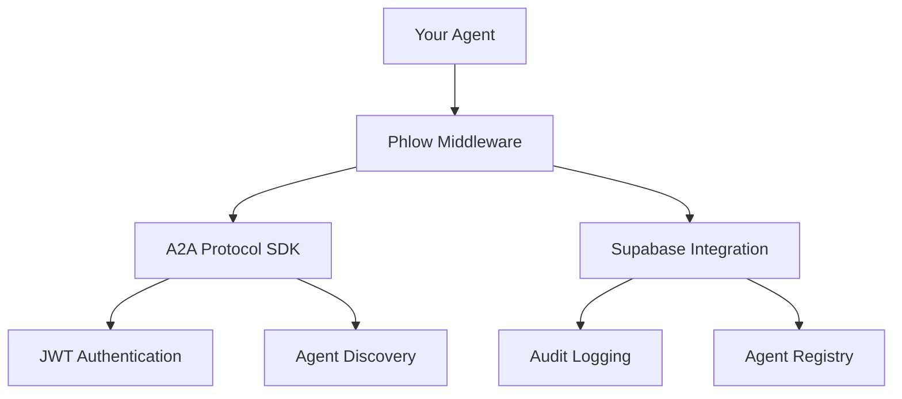

# Phlow

A2A Protocol extension with Supabase superpowers for enhanced agent authentication.

[Quick Start](quickstart.md){ .md-button .md-button--primary }
[GitHub](https://github.com/prassanna-ravishankar/phlow){ .md-button }

## What is Phlow?

Phlow extends the official [A2A Protocol SDK](https://github.com/a2aproject/a2a-js) with Supabase integration. Instead of reimplementing the A2A Protocol, Phlow adds production-ready features like audit logging, Row Level Security, and centralized agent registry.

## Simple Integration

=== "JavaScript"
    ```javascript
    import { PhlowMiddleware } from 'phlow-auth';

    const phlow = new PhlowMiddleware({
      agentCard: myA2AAgentCard,
      privateKey: process.env.PRIVATE_KEY,
      supabaseUrl: process.env.SUPABASE_URL,
      supabaseAnonKey: process.env.SUPABASE_ANON_KEY
    });

    app.post('/api/analyze', phlow.authenticate(), (req, res) => {
      const { agent, supabase } = req.phlow;
      res.json({ message: `Hello ${agent.name}` });
    });
    ```

=== "Python"
    ```python
    from phlow_auth import PhlowMiddleware

    phlow = PhlowMiddleware({
        'agent_card': my_a2a_agent_card,
        'private_key': os.getenv('PRIVATE_KEY'),
        'supabase_url': os.getenv('SUPABASE_URL'),
        'supabase_anon_key': os.getenv('SUPABASE_ANON_KEY')
    })

    @app.post("/api/analyze")
    @phlow.authenticate
    async def analyze(request: Request):
        agent = request.phlow.agent
        return {"message": f"Hello {agent.name}"}
    ```

## Features

- **Built on A2A SDK** - Full A2A Protocol compliance via official SDK
- **Supabase Integration** - Audit logs, RLS policies, agent registry
- **Enhanced Discovery** - A2A discovery + centralized registry
- **Audit Trail** - Track all authentication events
- **Multi-language** - JavaScript/TypeScript and Python
- **RLS Helpers** - Generate Row Level Security policies

## Architecture



## Getting Started

1. **[Quick Start](quickstart.md)** - Get running in 5 minutes
2. **[Installation](installation.md)** - Platform-specific setup  
3. **[Configuration](configuration.md)** - Learn the options
4. **[Examples](examples/basic-agent.md)** - See working code

## Why Phlow?

| Feature | A2A SDK | Phlow |
|---------|---------|-------|
| A2A Protocol | ✅ | ✅ |
| JWT Auth | ✅ | ✅ |
| Audit Logging | ❌ | ✅ |
| Rate Limiting | ❌ | ✅ |
| Database Integration | ❌ | ✅ |
| RLS Policies | ❌ | ✅ |

Phlow doesn't replace A2A - it extends it with production features.