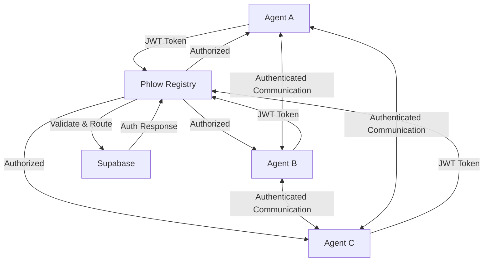

# Phlow - Agent-to-Agent Authentication Framework

<div class="hero-section" markdown>
The complete authentication framework for the agentic web.

[Get Started](getting-started.md){ .md-button .md-button--primary }
[View on GitHub](https://github.com/prassanna-ravishankar/phlow){ .md-button }
</div>

## Why Choose Phlow?

<div class="grid cards" markdown>

-   :material-security: **Secure by Design**

    ---

    JWT-based authentication with RS256 signatures, rate limiting, and comprehensive audit logging for enterprise-grade security.

-   :rocket: **Multi-Language Support**

    ---

    Native libraries for JavaScript/TypeScript and Python with FastAPI integration. More languages coming soon.

-   :zap: **Supabase Integration**

    ---

    Built-in Supabase support for agent registry, RLS policies, and scalable authentication infrastructure.

-   :material-tools: **Developer Tools**

    ---

    CLI tools for project initialization, key generation, token testing, and local development server.

-   :material-sync: **Production Ready**

    ---

    Rate limiting, audit logging, health checks, and comprehensive error handling for production deployments.

-   :material-book-open: **Great DX**

    ---

    Comprehensive documentation, working examples, and TypeScript support for the best developer experience.

</div>

## Quick Start

Get started in minutes with Phlow. Our CLI handles key generation, Supabase setup, and project initialization.

=== "Installation"

    ```bash
    # Install Phlow CLI
    npm install -g phlow-cli
    ```

=== "Initialize Project"

    ```bash
    # Initialize new project
    phlow init my-agent
    ```

=== "Development"

    ```bash
    # Start development server
    phlow dev-start
    
    # Test authentication
    phlow test-token --target my-agent
    ```

## Features

!!! tip "Enterprise Ready"

    Phlow is designed for production use with comprehensive security features, monitoring, and scalability built-in.

- **🔐 Secure Authentication**: RS256 JWT tokens with proper key management
- **🚀 Multi-Language**: JavaScript/TypeScript and Python support
- **⚡ Supabase Integration**: Built-in database and auth infrastructure
- **🛠️ CLI Tools**: Complete development toolkit
- **📊 Monitoring**: Built-in audit logging and health checks
- **🔄 Scalable**: Designed for high-throughput agent networks

## Architecture



## Next Steps

Ready to build your first agent? Check out our comprehensive guides:

- [Getting Started Guide](getting-started.md) - Set up your first Phlow agent
- [API Reference](api-reference.md) - Complete API documentation
- [Examples](examples/basic-agent.md) - Working code examples