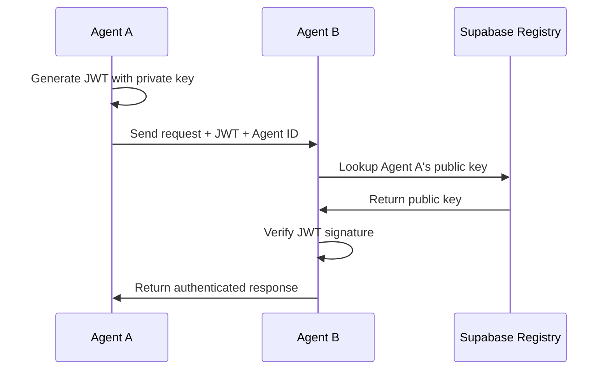

# Phlow - Agent-to-Agent Authentication Framework

<div class="hero-section" markdown>


JWT-based authentication for AI agent networks using Supabase.

[Get Started](getting-started.md){ .md-button .md-button--primary }
[View on GitHub](https://github.com/prassanna-ravishankar/phlow){ .md-button }
</div>

## 🔐 Zero-Config Agent Authentication

Phlow makes secure agent-to-agent authentication effortless. Your agents authenticate each other automatically using JWT tokens and public key cryptography.

### Protect Your Agent in One Line

=== "JavaScript"

    ```javascript
    // Your unprotected endpoint
    app.post('/analyze', (req, res) => {
      // Anyone can call this!
    });

    // Add Phlow = Instant authentication
    app.post('/analyze', phlow.authenticate(), (req, res) => {
      // Now only authenticated agents can access
      console.log(`Request from: ${req.phlow.agent.name}`);
      console.log(`Permissions: ${req.phlow.claims.permissions}`);
    });
    ```

=== "Python"

    ```python
    # Your unprotected endpoint
    @app.route('/analyze', methods=['POST'])
    def analyze():
        # Anyone can call this!
        pass

    # Add Phlow = Instant authentication
    @app.route('/analyze', methods=['POST'])
    @phlow.authenticate()
    def analyze():
        # Now only authenticated agents can access
        print(f"Request from: {request.agent['name']}")
        print(f"Permissions: {request.claims['permissions']}")
    ```

### Call Other Agents Securely

=== "JavaScript"

    ```javascript
    // Without Phlow: Complex auth setup
    const token = jwt.sign(payload, privateKey, { algorithm: 'RS256' });
    const response = await fetch(url, {
      headers: {
        'Authorization': `Bearer ${token}`,
        'X-Agent-ID': agentId
      }
    });

    // With Phlow: Authentication handled automatically
    const response = await phlow.callAgent('https://data-agent.ai/analyze', {
      dataset: 'sales-2024.csv'
    });
    ```

=== "Python"

    ```python
    # Without Phlow: Complex auth setup
    token = jwt.encode(payload, private_key, algorithm='RS256')
    response = requests.post(url, 
        headers={
            'Authorization': f'Bearer {token}',
            'X-Agent-ID': agent_id
        }
    )

    # With Phlow: Authentication handled automatically
    response = await phlow.call_agent('https://data-agent.ai/analyze', 
        json={'dataset': 'sales-2024.csv'}
    )
    ```

<div class="grid cards" markdown>

-   :material-shield-lock: **JWT + RSA Security**

    ---

    Industry-standard RS256 signed tokens with automatic key management

-   :material-clock-fast: **Zero Configuration**

    ---

    Authentication works out of the box - no complex setup required

-   :material-database: **Supabase Registry**

    ---

    Agent public keys stored securely and retrieved automatically

-   :material-check-all: **Permission System**

    ---

    Fine-grained access control with JWT claims and permissions

</div>

**No token generation. No key management. No auth headers.**

Just secure agent communication that works.

## Features

<div class="grid cards" markdown>

-   :material-security: **JWT Authentication**

    ---

    RS256-signed JWT tokens for secure agent-to-agent communication with Supabase as the registry.

-   :simple-javascript: **JavaScript & Python**

    ---

    Libraries for JavaScript/TypeScript and Python. Additional language support planned.

-   :simple-supabase: **Supabase Integration**

    ---

    Uses Supabase for agent registry and public key storage. Other auth backends planned.

-   :material-console: **CLI Tools**

    ---

    Command-line tools for project setup, key generation, and testing.

-   :material-cog: **Middleware**

    ---

    Express.js and FastAPI middleware for easy integration into existing projects.

-   :material-book: **Documentation**

    ---

    Working examples and comprehensive API documentation.

</div>

## Quick Start

=== "Installation"

    ```bash
    # Install Phlow CLI
    npm install -g phlow-cli
    ```

=== "Initialize Project"

    ```bash
    # Initialize new project
    phlow init my-agent
    ```

=== "Development"

    ```bash
    # Start development server
    phlow dev-start
    
    # Test authentication
    phlow test-token --target my-agent
    ```

## Current State & A2A Compatibility

!!! info "A2A Protocol Inspiration"

    Phlow is inspired by the [A2A Protocol specification](https://a2aproject.github.io/A2A/latest/specification/) and aims to provide A2A-compatible authentication as a foundation for agent networks.

**Current Features:**

- ✅ JWT-based authentication (compatible with A2A security schemes)
- ✅ Agent registry via Supabase (similar to A2A AgentCards)
- ✅ JavaScript/TypeScript and Python libraries
- ✅ Express.js and FastAPI middleware
- ✅ CLI tools for development and testing

**A2A Compatibility Roadmap:**

- 🔄 **AgentCard standard**: Implement A2A-compatible AgentCard format
- 🔄 **JSON-RPC 2.0**: Add JSON-RPC support alongside REST APIs  
- 🔄 **Well-known endpoints**: Support `/.well-known/agent.json` discovery
- 🔄 **Task management**: Add A2A task delegation and state management
- 🔄 **Streaming support**: Implement Server-Sent Events for real-time updates
- 🔄 **Multiple auth schemes**: Support OAuth 2.0, OpenID Connect, API keys
- 🔄 **Enhanced security**: TLS 1.3+ requirements and credential management

## How It Works



**Authentication Flow:**

1. **Agent A** creates a JWT token signed with its private key
2. **Agent A** sends a request to **Agent B** with the JWT in the Authorization header  
3. **Agent B** looks up **Agent A's** public key from the Supabase registry
4. **Agent B** verifies the JWT signature using **Agent A's** public key
5. If valid, **Agent B** processes the request and sends a response

## Documentation

- [Getting Started Guide](getting-started.md) - Set up your first agent
- [API Reference](api-reference.md) - Complete API documentation  
- [Examples](examples/basic-agent.md) - Working code examples