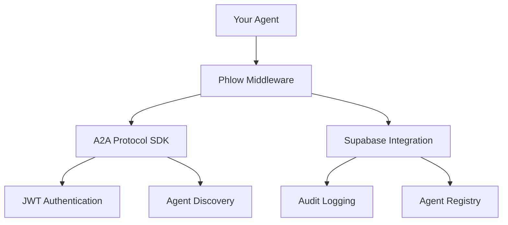

<div align="center">
  
</div>

# JWT Authentication + Supabase for AI Agents

Phlow is a simple middleware that adds Supabase integration to A2A Protocol authentication. It handles JWT verification, agent storage, and provides basic middleware for web frameworks.

[Get Started](quickstart.md){ .md-button .md-button--primary }
[View on GitHub](https://github.com/prassanna-ravishankar/phlow){ .md-button }

## What is Phlow?

Phlow extends A2A Protocol JWT authentication with Supabase storage. It verifies JWT tokens, stores agent cards in a database, and provides middleware helpers for Express and FastAPI applications.

## Simple Integration

```python
from phlow import PhlowMiddleware, AgentCard, PhlowConfig

config = PhlowConfig(
    agent_card=AgentCard(
        name="My Agent",
        description="AI assistant agent", 
        service_url="https://my-agent.com",
        skills=["chat", "analysis"],
        metadata={"agent_id": "my-agent-id", "public_key": os.getenv("PUBLIC_KEY")}
    ),
    private_key=os.getenv("PRIVATE_KEY"),
    supabase_url=os.getenv("SUPABASE_URL"),
    supabase_anon_key=os.getenv("SUPABASE_ANON_KEY")
)

phlow = PhlowMiddleware(config)
    
@app.post("/api/analyze")
@phlow.authenticate
async def analyze(request: Request):
    agent = request.phlow.agent
    return {"message": f"Hello {agent.name}"}
```

## Key Features

🔐 **Token Verification** - Validate A2A Protocol JWT tokens

📋 **Agent Storage** - Store and retrieve agent cards from Supabase

🛡️ **RLS Policies** - Generate basic Row Level Security rules

📊 **Event Logging** - Basic authentication event tracking

🔧 **Middleware** - Simple integration with web frameworks

🌐 **Multi-Language** - JavaScript and Python packages

## Architecture



## Getting Started

1. **[Quick Start](quickstart.md)** - Get running in 5 minutes
2. **[Installation](installation.md)** - Platform-specific setup  
3. **[Configuration](configuration.md)** - Learn the options
4. **[Examples](examples/basic-agent.md)** - See working code

## Why Use Phlow?

🔐 **JWT Verification** - Validates A2A Protocol tokens

📋 **Database Storage** - Store agent cards in Supabase

🛡️ **RLS Helpers** - Generate basic security policies

📊 **Simple Logging** - Track authentication events

🔧 **Easy Integration** - Middleware for Express and FastAPI

🌐 **Multi-Language** - JavaScript and Python support