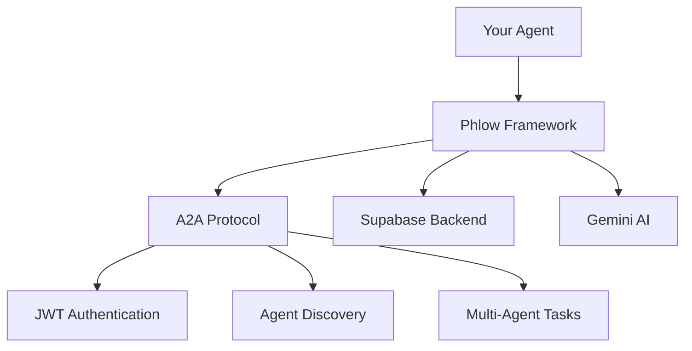

<div align="center">
  
</div>

# A2A Protocol Framework for AI Agents

Phlow is a pure Python framework for building A2A (Agent-to-Agent) Protocol compliant AI agents. It provides authentication, agent discovery, multi-agent communication, and Supabase integration with real AI capabilities via Gemini API.

[Get Started](quickstart.md){ .md-button .md-button--primary }
[View on GitHub](https://github.com/prassanna-ravishankar/phlow){ .md-button }

## What is Phlow?

Phlow is a complete A2A Protocol implementation that enables autonomous AI agents to discover and communicate with each other. It includes JWT authentication, agent card discovery, real AI integration via Gemini, and comprehensive testing infrastructure.

## Simple Integration

```python
from phlow import AgentCard, PhlowConfig
from phlow.integrations.fastapi import FastAPIPhlowAuth

# Configure your A2A agent
config = PhlowConfig(
    agent_card=AgentCard(
        name="My Agent",
        description="AI assistant agent", 
        service_url="https://my-agent.com",
        skills=["chat", "analysis"],
        metadata={"agent_id": "my-agent-id"}
    ),
    private_key=os.getenv("PRIVATE_KEY"),
    supabase_url=os.getenv("SUPABASE_URL"),
    supabase_anon_key=os.getenv("SUPABASE_ANON_KEY")
)

auth = FastAPIPhlowAuth(config)
    
@app.post("/api/analyze")
@auth.require_agent_auth
async def analyze(request: Request):
    agent = request.state.agent
    return {"message": f"Hello {agent.name}"}
```

## Key Features

🔐 **A2A Authentication** - JWT token verification with RSA keys

🤖 **Agent Discovery** - `/.well-known/agent.json` endpoint compliance

🤝 **Multi-Agent Communication** - Agent-to-Agent task delegation

🧠 **AI-Ready** - Framework designed for AI agent integration (examples include Gemini)

📊 **Supabase Integration** - Agent registry and audit logging

🧪 **Testing Infrastructure** - E2E tests with Docker auto-detection

## Architecture



## Getting Started

1. **[Quick Start](quickstart.md)** - Build your first A2A agent
2. **[Installation](installation.md)** - Setup guide  
3. **[Configuration](configuration.md)** - Environment variables
4. **[Example Agent](examples/simple/)** - Working code

## Development

```bash
# See all tasks
uv run task --list

# Run tests
uv run task test-unit          # Unit tests
uv run task test-e2e-multi     # Multi-agent E2E tests

# Code quality
uv run task lint format type-check
```