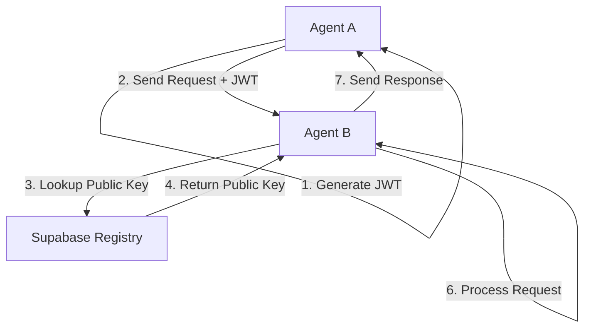

# Phlow - Agent-to-Agent Authentication Framework

<div class="hero-section" markdown>


JWT-based authentication for AI agent networks using Supabase.

[Get Started](getting-started.md){ .md-button .md-button--primary }
[View on GitHub](https://github.com/prassanna-ravishankar/phlow){ .md-button }
</div>

## 🎭 The Power of Agent Cards

Agent Cards transform AI agents into self-describing, discoverable services. Any agent can learn what another agent can do and how to interact with it - automatically.

### Create a Specialized Agent in Seconds

=== "JavaScript"

    ```javascript
    const dataAnalysisAgent = phlowAuth({
      agentCard: {
        name: "DataWizard",
        description: "AI agent specialized in data analysis",
        skills: ["data-analysis", "visualization", "statistical-modeling"],
        endpoints: {
          analyze: { method: "POST", path: "/analyze" }
        }
      }
    });

    // That's it! Your agent now:
    // ✓ Describes its capabilities at /.well-known/agent.json
    // ✓ Authenticates incoming agent requests
    // ✓ Is discoverable by other agents
    ```

=== "Python"

    ```python
    phlow = PhlowAuth(
        agent_card={
            "name": "DataWizard",
            "description": "AI agent specialized in data analysis",
            "skills": ["data-analysis", "visualization", "statistical-modeling"],
            "endpoints": {
                "analyze": {"method": "POST", "path": "/analyze"}
            }
        }
    )
    ```

### Discover and Use Other Agents

=== "JavaScript"

    ```javascript
    // Discover what an agent can do
    const agentCard = await researchAgent.discoverAgent('https://data-wizard.ai');
    console.log(`Skills: ${agentCard.skills.join(', ')}`);

    // Use it - authentication handled automatically
    const response = await researchAgent.callAgent('https://data-wizard.ai/analyze', {
      dataset: datasetUrl,
      analysis_type: 'regression'
    });
    ```

=== "Python"

    ```python
    # Discover what an agent can do
    agent_card = await phlow.discover_agent('https://data-wizard.ai')
    print(f"Skills: {', '.join(agent_card['skills'])}")

    # Use it - authentication handled automatically
    response = await phlow.call_agent(
        'https://data-wizard.ai/analyze',
        json={'dataset': dataset_url, 'analysis_type': 'regression'}
    )
    ```

<div class="grid cards" markdown>

-   :material-robot: **Self-Describing**

    ---

    Other agents instantly know your capabilities through standardized Agent Cards

-   :material-shield-check: **Auto-Authenticated**

    ---

    Secure agent-to-agent communication with zero boilerplate

-   :material-magnify: **Discoverable**

    ---

    Find and understand other agents programmatically

-   :material-connection: **Collaborative**

    ---

    Call other agents' endpoints with automatic authentication

</div>

**No manual API documentation. No authentication boilerplate. No discovery protocols.**  
Just agents that understand each other.

## Features

<div class="grid cards" markdown>

-   :material-security: **JWT Authentication**

    ---

    RS256-signed JWT tokens for secure agent-to-agent communication with Supabase as the registry.

-   :simple-javascript: **JavaScript & Python**

    ---

    Libraries for JavaScript/TypeScript and Python. Additional language support planned.

-   :simple-supabase: **Supabase Integration**

    ---

    Uses Supabase for agent registry and public key storage. Other auth backends planned.

-   :material-console: **CLI Tools**

    ---

    Command-line tools for project setup, key generation, and testing.

-   :material-cog: **Middleware**

    ---

    Express.js and FastAPI middleware for easy integration into existing projects.

-   :material-book: **Documentation**

    ---

    Working examples and comprehensive API documentation.

</div>

## Quick Start

=== "Installation"

    ```bash
    # Install Phlow CLI
    npm install -g phlow-cli
    ```

=== "Initialize Project"

    ```bash
    # Initialize new project
    phlow init my-agent
    ```

=== "Development"

    ```bash
    # Start development server
    phlow dev-start
    
    # Test authentication
    phlow test-token --target my-agent
    ```

## Current State & A2A Compatibility

!!! info "A2A Protocol Inspiration"

    Phlow is inspired by the [A2A Protocol specification](https://a2aproject.github.io/A2A/latest/specification/) and aims to provide A2A-compatible authentication as a foundation for agent networks.

**Current Features:**
- ✅ JWT-based authentication (compatible with A2A security schemes)
- ✅ Agent registry via Supabase (similar to A2A AgentCards)
- ✅ JavaScript/TypeScript and Python libraries
- ✅ Express.js and FastAPI middleware
- ✅ CLI tools for development and testing

**A2A Compatibility Roadmap:**
- 🔄 **AgentCard standard**: Implement A2A-compatible AgentCard format
- 🔄 **JSON-RPC 2.0**: Add JSON-RPC support alongside REST APIs  
- 🔄 **Well-known endpoints**: Support `/.well-known/agent.json` discovery
- 🔄 **Task management**: Add A2A task delegation and state management
- 🔄 **Streaming support**: Implement Server-Sent Events for real-time updates
- 🔄 **Multiple auth schemes**: Support OAuth 2.0, OpenID Connect, API keys
- 🔄 **Enhanced security**: TLS 1.3+ requirements and credential management

## How It Works



**Authentication Flow:**

1. **Agent A** creates a JWT token signed with its private key
2. **Agent A** sends a request to **Agent B** with the JWT in the Authorization header  
3. **Agent B** looks up **Agent A's** public key from the Supabase registry
4. **Agent B** verifies the JWT signature using **Agent A's** public key
5. If valid, **Agent B** processes the request and sends a response

## Documentation

- [Getting Started Guide](getting-started.md) - Set up your first agent
- [API Reference](api-reference.md) - Complete API documentation  
- [Examples](examples/basic-agent.md) - Working code examples