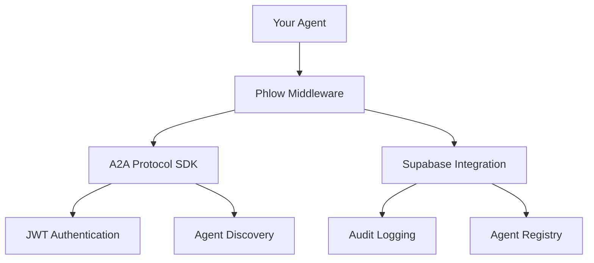

<div align="center">
  
</div>

# Secure Authentication for AI Agents

Phlow provides production-ready authentication middleware for AI agents with persistent storage, audit logging, and fine-grained access controls.

[Get Started](quickstart.md){ .md-button .md-button--primary }
[View on GitHub](https://github.com/prassanna-ravishankar/phlow){ .md-button }

## What is Phlow?

Phlow is an authentication middleware that enables secure communication between AI agents. Built on industry standards like JWT tokens and the A2A Protocol, it provides everything you need for production agent deployments including persistent storage, audit trails, and access controls.

## Simple Integration

=== "JavaScript"
    ```javascript
    import { PhlowMiddleware } from 'phlow-auth';

    const phlow = new PhlowMiddleware({
      agentCard: {
        schemaVersion: '1.0',
        name: 'My Agent',
        description: 'AI assistant agent',
        serviceUrl: 'https://my-agent.com',
        skills: ['chat', 'analysis'],
        securitySchemes: {},
        metadata: {
          agentId: 'my-agent-id',
          publicKey: process.env.PUBLIC_KEY
        }
      },
      privateKey: process.env.PRIVATE_KEY,
      supabaseUrl: process.env.SUPABASE_URL,
      supabaseAnonKey: process.env.SUPABASE_ANON_KEY
    });

    app.post('/api/analyze', phlow.authenticate(), (req, res) => {
      const { agent, supabase } = req.phlow;
      res.json({ message: `Hello ${agent.name}` });
    });
    ```

=== "Python"
    ```python
    from phlow_auth import PhlowMiddleware, AgentCard, PhlowConfig

    config = PhlowConfig(
        agent_card=AgentCard(
            name="My Agent",
            description="AI assistant agent", 
            service_url="https://my-agent.com",
            skills=["chat", "analysis"],
            metadata={"agent_id": "my-agent-id", "public_key": os.getenv("PUBLIC_KEY")}
        ),
        private_key=os.getenv("PRIVATE_KEY"),
        supabase_url=os.getenv("SUPABASE_URL"),
        supabase_anon_key=os.getenv("SUPABASE_ANON_KEY")
    )

    phlow = PhlowMiddleware(config)
    
    @app.post("/api/analyze")
    @phlow.authenticate
    async def analyze(request: Request):
        agent = request.phlow.agent
        return {"message": f"Hello {agent.name}"}
    ```

## Key Features

🔐 **JWT Authentication** - Secure agent-to-agent authentication

📋 **Agent Registry** - Persistent storage of agent capabilities and metadata

🛡️ **Access Controls** - Row Level Security policies for data protection

📊 **Audit Logging** - Complete audit trail for security and compliance

🌐 **Multi-Language** - JavaScript/TypeScript and Python support

⚡ **Production Ready** - Rate limiting, monitoring, and error handling

## Architecture



## Getting Started

1. **[Quick Start](quickstart.md)** - Get running in 5 minutes
2. **[Installation](installation.md)** - Platform-specific setup  
3. **[Configuration](configuration.md)** - Learn the options
4. **[Examples](examples/basic-agent.md)** - See working code

## Why Choose Phlow?

🔐 **Secure by Default** - Industry-standard JWT authentication with proper key management

📋 **Persistent Storage** - Agent registry and session data stored in Supabase

🛡️ **Access Controls** - Row Level Security policies for fine-grained permissions

📊 **Audit Ready** - Complete audit trails for compliance and monitoring

⚡ **Production Ready** - Rate limiting, error handling, and monitoring built-in

🌐 **Multi-Language** - JavaScript/TypeScript and Python support