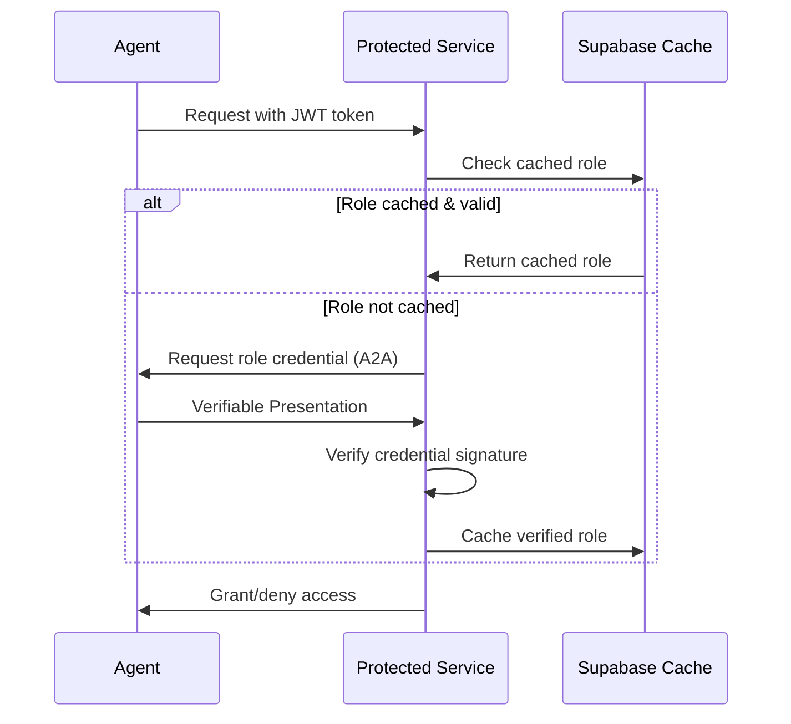

# Role-Based Access Control (RBAC)

Phlow's RBAC system enables fine-grained access control using W3C Verifiable Credentials and cryptographic role verification.

## Overview

RBAC extends Phlow's authentication with role-based authorization, allowing agents to prove they possess specific roles through verifiable credentials.

```python
from phlow.integrations.fastapi import phlow_auth_role

@app.post("/admin-only")
async def admin_endpoint(
    context: PhlowContext = Depends(phlow_auth_role(middleware, "admin"))
):
    return {"message": "Admin access granted!"}
```

## How It Works

1. **Role Credentials**: Agents store W3C Verifiable Credentials containing role assertions
2. **Verification Flow**: Server requests role proof via A2A protocol
3. **Cryptographic Validation**: Credentials are verified using issuer's public key
4. **Caching**: Valid roles are cached in Supabase for performance



## Core Components

### RoleCredentialStore
Client-side credential storage and management:

```python
from phlow.rbac import RoleCredentialStore

store = RoleCredentialStore()
await store.add_credential(admin_credential)

# Create presentation for verification
presentation = await store.create_presentation(
    role="admin",
    holder_did="did:example:agent"
)
```

### Middleware Integration
Server-side role verification:

```python
from phlow import PhlowMiddleware

middleware = PhlowMiddleware(config)

# Verify agent has specific role
context = await middleware.authenticate_with_role(token, "admin")
print(f"Agent has verified roles: {context.verified_roles}")
```

### FastAPI Integration
Protect endpoints with role requirements:

```python
from phlow.integrations.fastapi import FastAPIPhlowAuth

auth = FastAPIPhlowAuth(middleware)

@app.get("/manager-only")
async def manager_endpoint(
    context: PhlowContext = Depends(auth.create_role_auth_dependency("manager"))
):
    return {"authorized": True}
```

## Database Schema

RBAC adds a `verified_roles` table for caching:

```sql
CREATE TABLE verified_roles (
    id UUID DEFAULT gen_random_uuid() PRIMARY KEY,
    agent_id TEXT NOT NULL,
    role TEXT NOT NULL,
    verified_at TIMESTAMP WITH TIME ZONE NOT NULL DEFAULT NOW(),
    expires_at TIMESTAMP WITH TIME ZONE,
    credential_hash TEXT NOT NULL,
    issuer_did TEXT,
    UNIQUE(agent_id, role)
);
```

## Security Model

- **Cryptographic Verification**: All credentials verified using W3C standards
- **DID-based Identity**: Issuer and holder identification via DIDs
- **Expiration Handling**: Automatic cleanup of expired credentials
- **Row-Level Security**: Database policies restrict access to own roles

## Example Agent

See the complete [RBAC example agent](../examples/rbac_agent/) for a working implementation demonstrating:

- Role credential storage
- A2A message handling
- Protected endpoints
- Credential management

## Production Considerations

⚠️ This implementation includes simplified cryptographic verification and A2A messaging suitable for development and testing. For production deployment:

1. **Implement cryptographic signature verification** using issuer public keys and standard signature suites
2. **Add proper A2A messaging** with agent endpoint resolution and network error handling
3. **Configure restrictive database policies** based on your specific security requirements
4. **Add monitoring and rate limiting** for role verification requests

## API Reference

### phlow_auth_role()
```python
def phlow_auth_role(
    middleware: PhlowMiddleware,
    required_role: str,
    allow_expired: bool = False
) -> Callable
```

Create FastAPI dependency requiring specific role.

**Parameters:**
- `middleware`: PhlowMiddleware instance
- `required_role`: Role string (e.g., "admin", "manager")
- `allow_expired`: Whether to accept expired tokens

**Returns:** FastAPI dependency function

### authenticate_with_role()
```python
async def authenticate_with_role(
    self,
    token: str,
    required_role: str
) -> PhlowContext
```

Verify agent has required role credential.

**Parameters:**
- `token`: JWT authentication token
- `required_role`: Role to verify

**Returns:** PhlowContext with verified_roles populated

**Raises:** AuthenticationError if role verification fails
